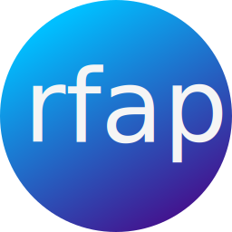

# rfap - Reliable File Access Protocol

**This project is in alpha stage, so expect radical changes to come.**

This repository contains documentation, specifications, overviews,
organizational information and general discussions about the protocol. See
[related projects](#related-projects-in-progress) for actual implementations.

## Protocol specifications (in progress)

- for general protocol specifications, see [specification.md](./specification.md)
- for YML metadata specification, see [metadata-example.yml](./metadata-example.yml)
- for a full overview of commands, see [commands.md](./commands.md)
- for a full overview of error codes, see [errors.md](./errors.md)

## Related projects (in progress)

Note: none of these projects has reached a stable release so far.

 - https://github.com/alexcoder04/rfap-go-server - reference server implementation
 - https://github.com/alexcoder04/librfap - Python library
 - https://github.com/BoettcherDasOriginal/rfap-cs-lib - C# library
 - https://github.com/alexcoder04/rfap-pycli - Python CLI client based on librfap

## Contributing

Please see [CONTRIBUTING.md](./CONTRIBUTING.md) for more information.

## Why did we start this project?

FTP is too old.

NFS is unencrypted.

SMB is too complex.

WebDAV makes not much sense.

SSHFS is for nerds.

*So what is the best way to share files?*

